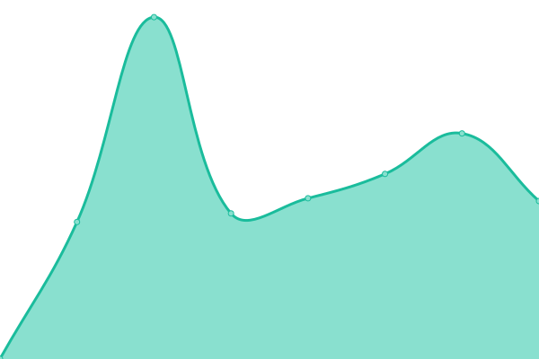

# [📈 Live Status](https://Der-Reiskoch.github.io/upptime): <!--live status--> **🟩 All systems operational**

This repository contains the open-source uptime monitor and status page for [Der Reiskoch](https://der.reisko.ch), powered by [Upptime](https://github.com/upptime/upptime).

With [Upptime](https://upptime.js.org), you can get your own unlimited and free uptime monitor and status page, powered entirely by a GitHub repository. We use [Issues](https://github.com/Der-Reiskoch/upptime/issues) as incident reports, [Actions](https://github.com/Der-Reiskoch/upptime/actions) as uptime monitors, and [Pages](https://Der-Reiskoch.github.io/upptime) for the status page.

<!--start: status pages-->
<!-- This summary is generated by Upptime (https://github.com/upptime/upptime) -->
<!-- Do not edit this manually, your changes will be overwritten -->
<!-- prettier-ignore -->
| URL | Status | History | Response Time | Uptime |
| --- | ------ | ------- | ------------- | ------ |
|  [Blog](https://der.reisko.ch) | 🟩 Up | [blog.yml](https://github.com/Der-Reiskoch/upptime/commits/HEAD/history/blog.yml) | 

 1346ms
     
 | 

<a href="https://Der-Reiskoch.github.io/upptime/history/blog">100.00%</a>
    

|  [Comments Service](https://kommentiere-den.reisko.ch) | 🟩 Up | [comments-service.yml](https://github.com/Der-Reiskoch/upptime/commits/HEAD/history/comments-service.yml) | 

 1133ms
     
 | 

<a href="https://Der-Reiskoch.github.io/upptime/history/comments-service">100.00%</a>
    

|  [Media Server](https://bebildere-den.reisko.ch/logo.png) | 🟩 Up | [media-server.yml](https://github.com/Der-Reiskoch/upptime/commits/HEAD/history/media-server.yml) | 

 871ms
     
 | 

<a href="https://Der-Reiskoch.github.io/upptime/history/media-server">100.00%</a>
    

<!--end: status pages-->

[**Visit our status website →**](https://Der-Reiskoch.github.io/upptime)

## 📄 License

- Powered by: [Upptime](https://github.com/upptime/upptime)
- Code: [MIT](./LICENSE) © [Der Reiskoch](https://der.reisko.ch)
- Data in the `./history` directory: [Open Database License](https://opendatacommons.org/licenses/odbl/1-0/)
